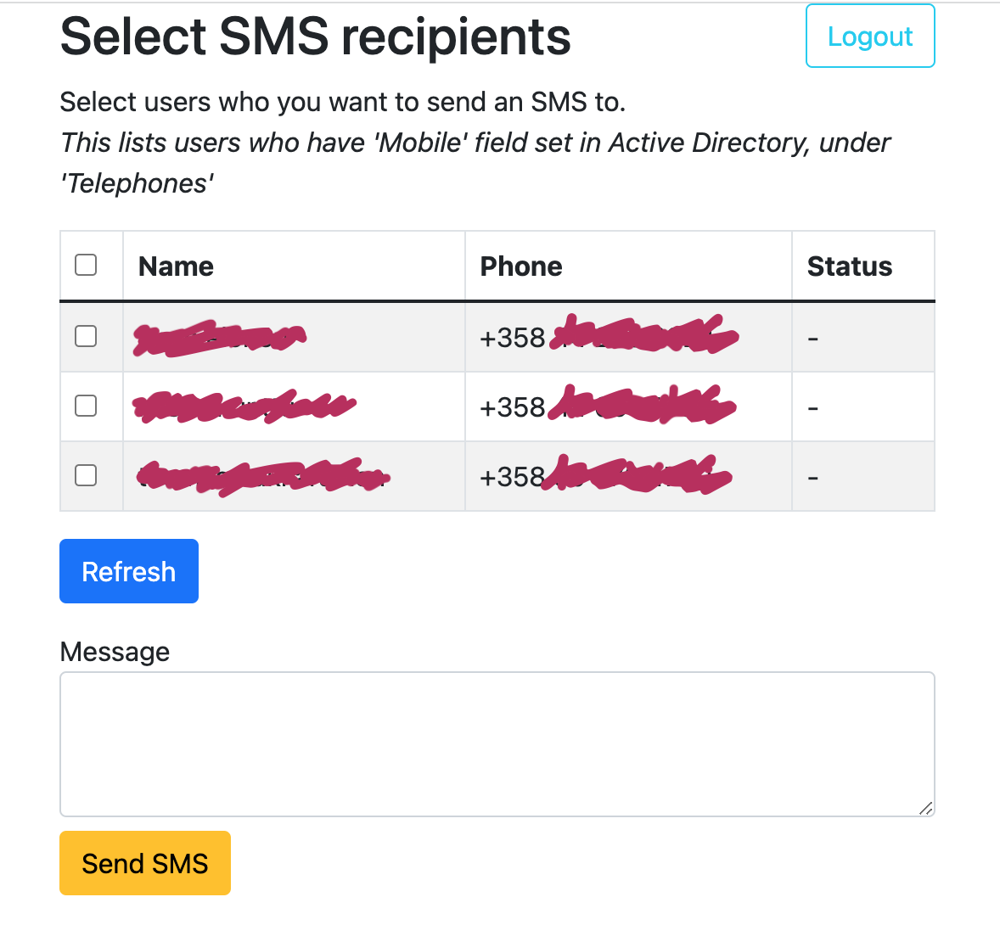

# AD to SMS sender 

A web based app for sending text message to Active Directory users.
Features:

 * Requires a login with a valid AD account. Authorizes against given group, allowing only members to send messages.
 * Lists users who have "Telephones / Mobile" field set in their AD entry
 * Allows selecting all or some of the listed users as SMS recipients
 * Optionally users (in "viewers" AD group) can also just use it as a phone

Used tech:

 * Python 3.7 + Flask for backend server
 * Bootstrap and Jquery for frontend
 * LDAPS for AD queries
 * AWS SNS for sending SMS

## Screenshot

><kbd></kbd>

## Configuration

Server reads configuration from environment variables. Example:

```
#!/bin/bash
source _venv/bin/activate

export LDAP_SERVER="ldaps://dc.mydomain.example"
export LDAP_BASE="OU=Users,DC=mydomain,DC=example"

export LDAP_AUTH_SENDER_GROUP='CN=ACL_SMS_Gateway,OU=ServiceACLs,OU=ACLs,DC=mydomain,DC=example'   # send SMS
export LDAP_AUTH_VIEWER_GROUP='CN=ACL_Phonebook,OU=ServiceACLs,OU=ACLs,DC=mydomain,DC=example'  # view numbers only

export LDAP_AUTH_DEFAULT_DOMAIN="@mydomain.example"  # appended to username (sAMAccount)
export LDAP_BIND_USER="CN=SMS_gateway,OU=Services,OU=Users,DC=mydomain,DC=example"
export LDAP_BIND_PASS="<password_here>"

export AWS_ACCESS_KEY_ID="<access_key_here>"
export AWS_SECRET_ACCESS_KEY="<secret_key_here>"
export AWS_REGION="eu-north-1"
export AWS_SMS_SENDER_ID="SenderName"
export AWS_SMS_DEFAULT_COUNTRY_CODE="+358"  # used if number starts with 0

#export FLASK_ENV=development  # enable debug logs
python main.py
```

## Installing and running

Install requirements with `pip install -r requirements.txt`, preferably
in a _venv_.

Running `python main.py`, it starts an HTTP server at 127.0.0.1:5000.
If any environment variables are missing, it will give an error and exit.
You'll probably want to create a shell script, similar to the one above.

Authentication happens with _HTTP Basic_, which is __plaintext__ so
make sure to use an __HTTPS  reverse proxy__ like Nginx in production.

Flask also recommends setting up WSGI (e.g. Gunicorn) for hosting in
production instead of the built-in server, but this app shouldn't need much
scalability  by its nature, so I haven't bothered.

## License

Copyright 2022 Jarno Elonen <elonen@iki.fi>

Licensed under the Apache License, Version 2.0 (the "License");
you may not use this file except in compliance with the License.
You may obtain a copy of the License at

    http://www.apache.org/licenses/LICENSE-2.0

Unless required by applicable law or agreed to in writing, software
distributed under the License is distributed on an "AS IS" BASIS,
WITHOUT WARRANTIES OR CONDITIONS OF ANY KIND, either express or implied.
See the License for the specific language governing permissions and
limitations under the License.
